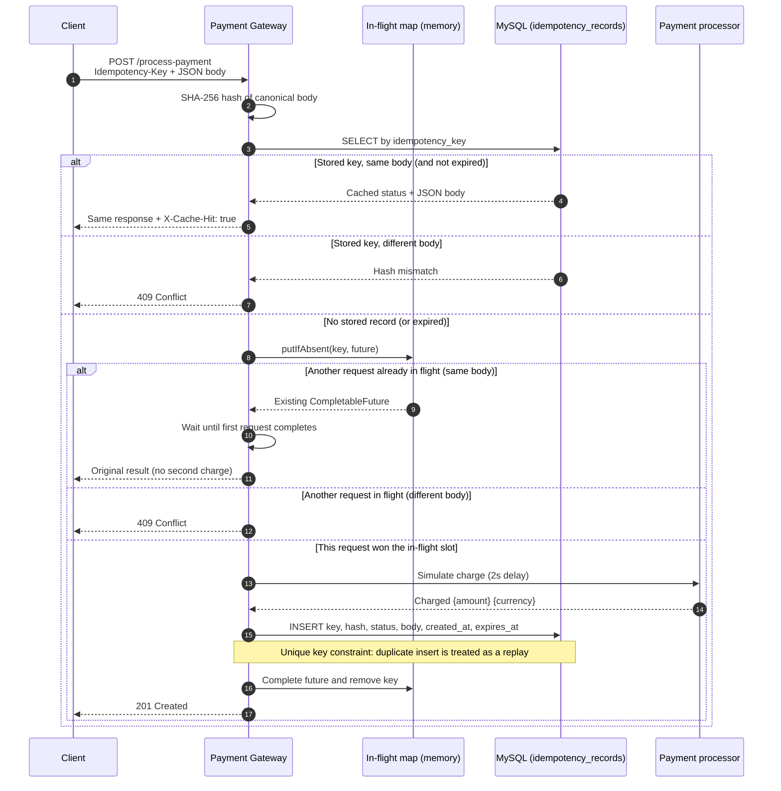

# Idempotency Gateway

FinSafe Transactions Ltd. needed a pay-once layer so that client retries after network timeouts do not charge a customer twice. This service is a Spring Boot REST API that accepts payment requests keyed by an `Idempotency-Key` header: the first request is processed and stored in MySQL, later retries with the same key and body replay the stored result, and a reused key with a different body is rejected.

## Architecture Diagram



Expired rows are ignored on read (and deleted) and removed by a scheduled purge so the table stays bounded.

## Setup Instructions

**Prerequisites**

- JDK 17 or later
- Apache Maven 3.9+
- MySQL 8 on port **3308**, or Docker for the bundled Compose file

**1. Start MySQL**

Option A — Docker (password comes from your environment):

```bash
# PowerShell
$env:DB_PASSWORD="your_mysql_password_here"
docker compose up -d
```

```bash
# bash
export DB_PASSWORD=your_mysql_password_here
docker compose up -d
```

Option B — existing local MySQL on `localhost:3308`. Create a user/root password you will export as `DB_PASSWORD`. The JDBC URL uses `createDatabaseIfNotExist=true`, so the `idempotency_gateway` schema is created if it is missing. Hibernate `ddl-auto=update` creates the `idempotency_records` table on first startup.

**2. Set `DB_PASSWORD` (required)**

The app does not ship a default password. If the variable is missing, Spring fails fast (`Could not resolve placeholder 'DB_PASSWORD'`).

```bash
# PowerShell (current session)
$env:DB_PASSWORD="your_mysql_password_here"

# bash
export DB_PASSWORD=your_mysql_password_here
```

In IntelliJ: Run → Edit Configurations → your Spring Boot run config → Environment variables → `DB_PASSWORD=...`.

See `.env.example` for the variable name. Do not commit a real `.env` file.

**3. Run the API**

```bash
mvn spring-boot:run
```

The server listens on **http://localhost:8080**. Processing delay (2 seconds) and key TTL (24 hours) are set in `src/main/resources/application.properties`.

## API Documentation

### `POST /process-payment`

| Item | Value |
|------|--------|
| Header | `Idempotency-Key` (required) |
| Body | `{ "amount": 100, "currency": "GHS" }` |
| Content-Type | `application/json` |

#### 1. First request (happy path)

Processing sleeps for two seconds, then persists the outcome in MySQL.

```bash
curl -i -X POST http://localhost:8080/process-payment \
  -H "Content-Type: application/json" \
  -H "Idempotency-Key: pay-001" \
  -d "{\"amount\":100,\"currency\":\"GHS\"}"
```

**201 Created**

```json
{ "status": "Charged 100 GHS" }
```

#### 2. Duplicate request (same key, same body)

No processing delay. Same status and body as the original.

```bash
curl -i -X POST http://localhost:8080/process-payment \
  -H "Content-Type: application/json" \
  -H "Idempotency-Key: pay-001" \
  -d "{\"amount\":100,\"currency\":\"GHS\"}"
```

**201 Created** with header `X-Cache-Hit: true`

```json
{ "status": "Charged 100 GHS" }
```

#### 3. Conflict (same key, different body)

```bash
curl -i -X POST http://localhost:8080/process-payment \
  -H "Content-Type: application/json" \
  -H "Idempotency-Key: pay-001" \
  -d "{\"amount\":500,\"currency\":\"GHS\"}"
```

**409 Conflict**

```json
{ "error": "Idempotency key already used for a different request body." }
```

#### 4. In-flight wait (same key while the first request is still processing)

Send two identical requests at the same time. Request B must not start a second charge and must not return 409. It waits on the same in-memory `CompletableFuture` and returns Request A's 201 body after processing finishes. Only the completed result is written to MySQL.

```bash
curl -i -X POST http://localhost:8080/process-payment \
  -H "Content-Type: application/json" \
  -H "Idempotency-Key: pay-inflight" \
  -d "{\"amount\":100,\"currency\":\"GHS\"}" &
curl -i -X POST http://localhost:8080/process-payment \
  -H "Content-Type: application/json" \
  -H "Idempotency-Key: pay-inflight" \
  -d "{\"amount\":100,\"currency\":\"GHS\"}" &
wait
```

#### Other errors

Missing `Idempotency-Key` or malformed JSON → **400 Bad Request** with `{ "error": "..." }`.

## Design Decisions

**MySQL + Spring Data JPA for completed records.** Idempotency keys must survive process restarts. A payment processor also needs an audit trail (who charged what, with which key). Hibernate `ddl-auto=update` creates `idempotency_records` automatically. A unique constraint on `idempotency_key` is the last line of defence if two JVMs both try to insert the same key; `DataIntegrityViolationException` is turned into a replay of the row that won the insert.

**In-memory `ConcurrentHashMap` + `CompletableFuture` for in-flight work only.** While a charge is still in the 2-second simulation, there is no row yet. Concurrent retries on the same instance share one future via `putIfAbsent`. That state is useless after the HTTP calls finish, so it stays in memory. Completed responses live in MySQL.

**SHA-256 of a canonical body.** Amount is normalized (`stripTrailingZeros`) and currency is trimmed and upper-cased before hashing. The table stores the hash, not a brittle JSON string compare, so `100` and `100.0` are the same payment. A hash mismatch is a 409 conflict.

**Why not Redis-only.** Redis is excellent for hot idempotency windows in a multi-node cluster. This service uses MySQL because reviewers can inspect rows with SQL, the data model matches a typical fintech ledger sidecar, and JPA keeps the code portable. A production cluster might add Redis in front for sub-millisecond lookups and still persist to MySQL.

## The Developer's Choice

**TTL / automatic key expiry.** Keys expire after `idempotency.key.ttl-hours` (default **24 hours**). `expires_at` is stored on each row. Reads skip (and delete) expired rows; a `@Scheduled` job runs `DELETE ... WHERE expires_at < now` on `idempotency.purge-interval-ms` (default 1 hour).

Stripe, PayPal, and similar APIs treat idempotency keys as valid only inside a window (often 24 hours). After that, the same key may be reused and the table stays bounded.

## Testing

```bash
mvn test
```

- Unit tests (`PaymentServiceTest`) mock `IdempotencyRecordRepository` and cover new key, duplicate replay, hash conflict, unique-constraint races, and concurrent in-flight sharing of a single charge.
- Scheduler tests verify the purge job calls `deleteByExpiresAtBefore`.
- Integration tests (`PaymentControllerIntegrationTest`) use **Testcontainers MySQL** so reviewers do not need a local database. Docker must be running. Tests use a 200ms processing delay via `src/test/resources/application.properties`.
